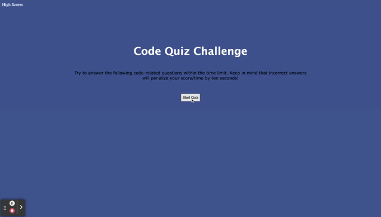

# Code-Quiz
Create a timed quiz on JavaScript fundamentals that stores high scores so that I can see my  progress compared to my peers.


## Acceptance Criteria

```
GIVEN I am taking a code quiz
WHEN I click the start button
THEN a timer starts and I am presented with a question
WHEN I answer a question
THEN I am presented with another question
WHEN I answer a question incorrectly
THEN time is subtracted from the clock
WHEN all questions are answered or the timer reaches 0
THEN the game is over
WHEN the game is over
THEN I can save my initials and my score
```

* Deployed URL: https://sflores926.github.io/Code-Quiz/
* Repo Link: https://github.com/sflores926/Code-Quiz

The following animation demonstrates the application functionality:

